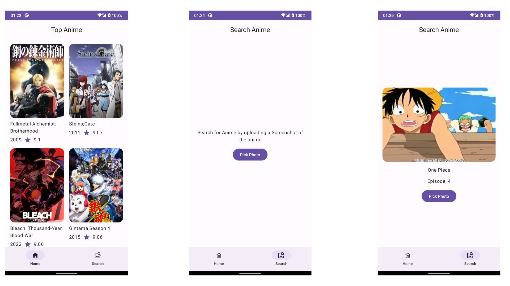

# AniWave

AniWave is an anime app used to view and search anime. The app is entirely built using Kotlin and
Jetpack Compose.

# Running the Project

IDE: Android Studio Giraffe | 2022.3.1+

Build System: Gradle

# Build

The app has `debug` & `release` build variants. `debug` is used for normal development workflows
while `release` has R8 turned on. Use the release variant for a real world user journey.

# Appetize

You can run the app on [Appetize.io](https://appetize.io/app/65qlvo72l5dbek24773yncba2u)

# Features

1. The app loads the top twenty five anime from [Jikan API](https://docs.api.jikan.moe/), an
   unofficial [MyAnimeList](https://myanimelist.net/) API
2. The list of anime is displayed in a Compose LazyVerticalGrid
3. A user can search for an anime by uploading a screenshot file. Returns the anime title & episode

# Architecture

AniWave follows Google's recommended
[guide to app architecture](https://developer.android.com/topic/architecture).
It is divided into two parts:

1. Data Layer - Repository, Data Sources
2. UI Layer - Composable Screens, State holders (ViewModel)

# UI

The app UI is built with [Jetpack Compose](https://developer.android.com/jetpack/compose) Material3
components

# Static Checks

To apply Kotlin style guidance and fix code formatting issues run `Static Checks`
